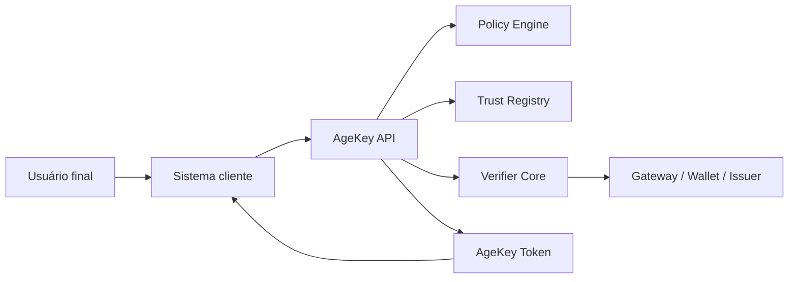
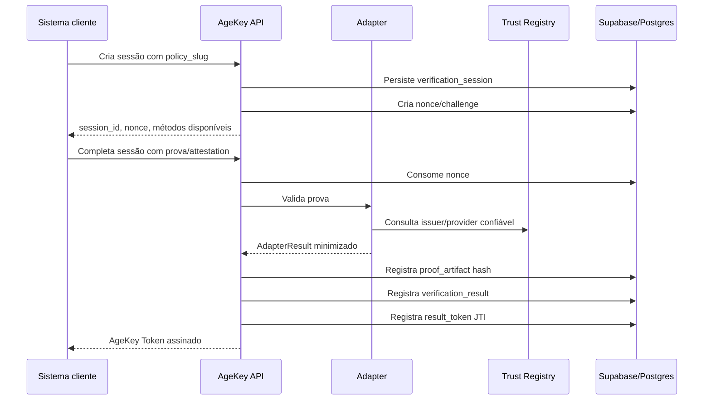
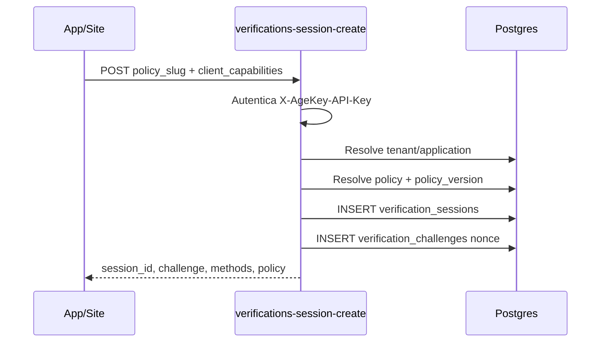
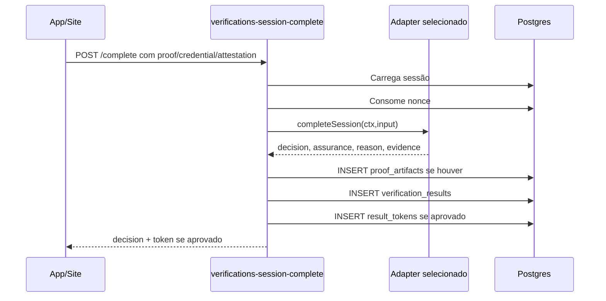
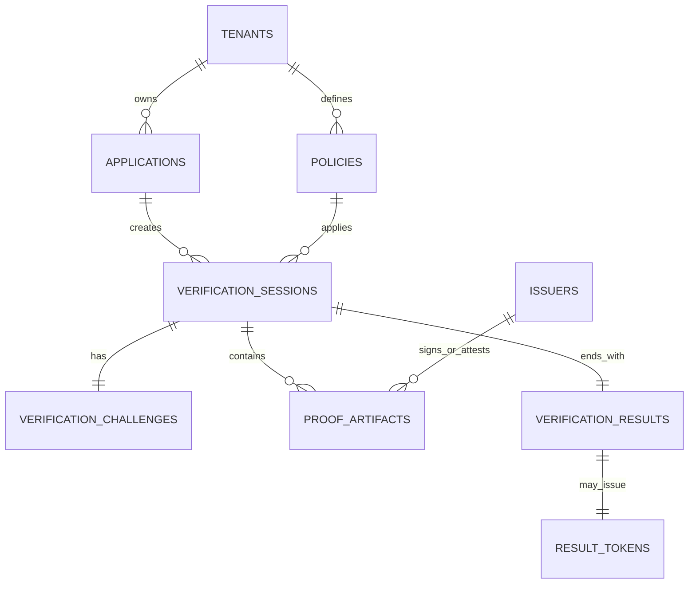
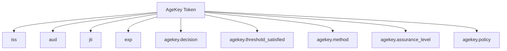
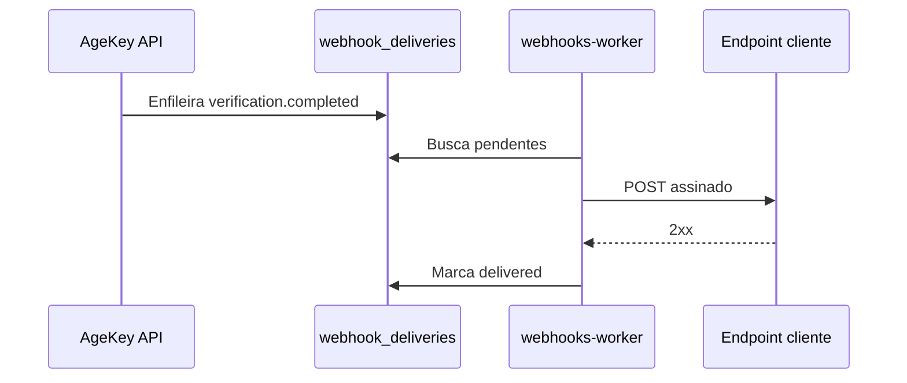

# Manual de Funcionamento e Fluxos - AgeKey

## 1. O que é o AgeKey

AgeKey é uma infraestrutura de age assurance para sistemas digitais. A função central é permitir que uma plataforma saiba se uma pessoa atende a uma política etária, como 13+, 16+, 18+ ou 21+, sem que a plataforma precise receber documento, data de nascimento, nome civil ou idade exata.

Em linguagem simples: o AgeKey responde "esta pessoa satisfaz a regra etária exigida?" sem transformar essa resposta em cadastro civil.

## 2. O que o AgeKey não é

AgeKey não é KYC.  
AgeKey não é uma base de identidade.  
AgeKey não é um banco de documentos.  
AgeKey não é reconhecimento facial.  
AgeKey não deve armazenar CPF, RG, passaporte, selfie, nome completo ou data de nascimento.

O produto existe para reduzir coleta de dados, não para aumentar.

## 3. Quem participa do fluxo



Usuário final: pessoa que precisa acessar um serviço.  
Sistema cliente: site, app, edtech, rede social, plataforma ou serviço digital que licencia AgeKey.  
AgeKey API: backend que cria sessão, valida prova e emite token.  
Policy Engine: módulo que define qual regra deve ser satisfeita.  
Trust Registry: lista de issuers, wallets e providers confiáveis.  
Verifier Core: núcleo que chama o adapter correto.  
Gateway/Wallet/Issuer: fonte externa de atestação ou prova.  
AgeKey Token: resultado assinado e temporário.

## 4. Visão geral do ciclo de vida



## 5. Fluxo para leigos

Imagine uma escola digital que tem uma área permitida apenas para maiores de 16 anos.

1. A escola chama o AgeKey.
2. O AgeKey cria uma sessão temporária.
3. O usuário prova a regra por carteira digital, gateway ou declaração controlada.
4. O AgeKey valida a prova.
5. A escola recebe apenas uma chave dizendo se a regra foi satisfeita.
6. A escola não recebe documento, idade exata ou data de nascimento.

## 6. Fluxo técnico de criação de sessão



Entrada mínima:

```json
{
  "policy_slug": "br-18-plus",
  "client_capabilities": {
    "platform": "web",
    "digital_credentials_api": true,
    "wallet_present": false
  },
  "locale": "pt-BR"
}
```

Saída mínima:

```json
{
  "session_id": "uuid",
  "status": "pending",
  "challenge": {
    "nonce": "random",
    "expires_at": "timestamp"
  },
  "available_methods": ["vc", "gateway", "fallback"],
  "preferred_method": "vc"
}
```

## 7. Fluxo técnico de conclusão



## 8. Métodos suportados

### 8.1 Fallback

Uso: menor fricção e menor garantia.  
Resultado típico: assurance `low`.  
Não deve ser usado para contexto regulatório forte sem escalonamento.

### 8.2 Gateway

Uso: provider externo valida e retorna atestação assinada.  
O core AgeKey deve receber apenas atestação normalizada, nunca documento bruto.

### 8.3 Verifiable Credential

Uso: wallet/issuer apresenta credencial com divulgação seletiva.  
O AgeKey valida assinatura, issuer, nonce, expiração e revogação.

### 8.4 ZKP / Predicate Attestation

Uso atual prudente: predicate attestation JWS.  
Uso futuro: BBS+/BLS12-381 quando houver biblioteca, issuer, wallet e test vectors.

## 9. Diagrama de dados



## 10. O que fica salvo

Salvo:

- sessão;
- tenant;
- application;
- policy;
- nonce consumido;
- hash da prova;
- decisão;
- assurance level;
- reason code;
- JTI do token;
- eventos mínimos de auditoria e billing.

Não salvo:

- data de nascimento;
- documento civil;
- imagem de documento;
- selfie;
- nome completo;
- CPF/RG/passaporte;
- idade exata.

## 11. Token AgeKey

O token é uma resposta temporária e assinada. Ele contém a política satisfeita, método, nível de garantia, decisão e expiração. Ele não contém identidade civil.



## 12. Validação pelo cliente

O cliente pode validar:

1. online, chamando o endpoint de token verify;
2. offline, usando JWKS público.

Para ambientes regulados, validação online é preferível porque permite checar revogação.

## 13. Segurança mínima

- API key por application.
- Rate limit.
- Nonce de uso único.
- Token com expiração.
- JWKS público.
- RLS no banco.
- service_role somente server-side.
- Storage não público para artefatos.
- Logs sem PII.

## 14. Fluxo de webhook



## 15. Deploy

A arquitetura alvo usa:

- GitHub para versionamento;
- Supabase para banco, Auth, Storage e Edge Functions;
- Vercel para painel, site, docs e fluxos web;
- domínio `agekey.com.br`.

Subdomínios recomendados:

```txt
agekey.com.br
app.agekey.com.br
api.agekey.com.br
verify.agekey.com.br
docs.agekey.com.br
status.agekey.com.br
staging.agekey.com.br
```

## 16. Manual de uso para cliente integrador

### Passo 1 - Criar application

No painel AgeKey, o tenant cria uma application e recebe API key.

### Passo 2 - Criar policy

Exemplo: `br-18-plus`, threshold 18, assurance `substantial`.

### Passo 3 - Instalar SDK ou chamar API

Web:

```ts
const session = await agekey.createSession({
  policy_slug: "br-18-plus",
  client_capabilities: { platform: "web" }
});
```

### Passo 4 - Completar verificação

O usuário passa pelo fluxo e o sistema recebe decisão e token.

### Passo 5 - Validar token

Server-side:

```ts
const result = await agekey.verifyToken(token);
if (result.valid && result.claims.agekey.decision === "approved") {
  allowAccess();
}
```

## 17. Checklist operacional

Antes de produção:

- DNS configurado.
- Supabase staging e production separados.
- Vercel env vars revisadas.
- service role ausente do frontend.
- key rotation validada.
- RLS testado.
- token verify testado.
- webhook signature testado.
- pentest executado.
- RIPD/DPIA aprovado.
- logs revisados para PII.
