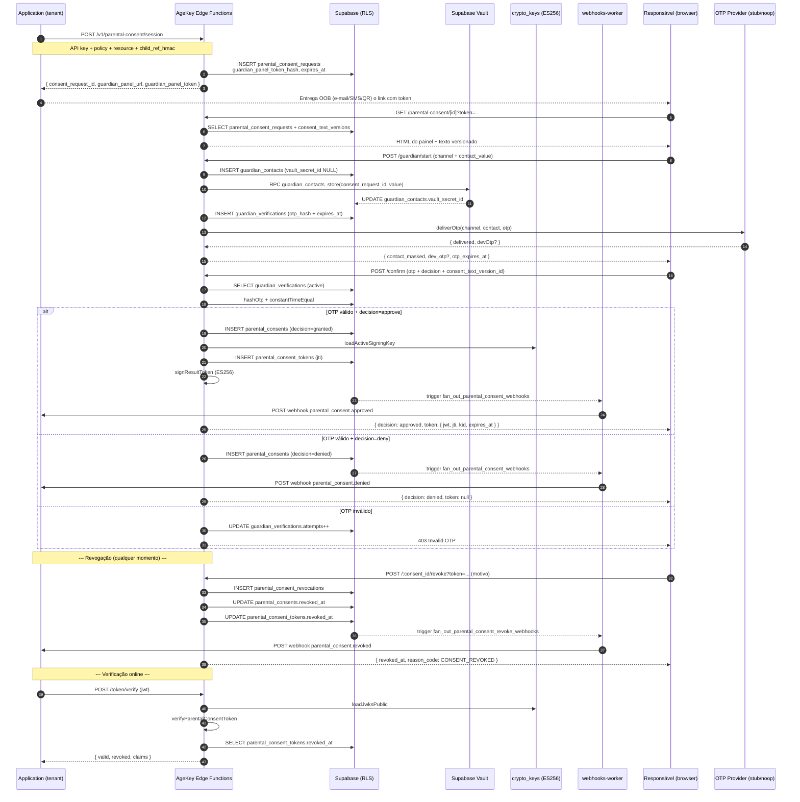

# AgeKey Consent — Sequence Diagram

> Diagrama de sequência completo do fluxo de consentimento parental.

```mermaid
sequenceDiagram
    autonumber
    participant App as Application (tenant)
    participant API as AgeKey Edge Functions
    participant DB as Supabase (RLS)
    participant Vault as Supabase Vault
    participant Crypto as crypto_keys (ES256)
    participant Worker as webhooks-worker
    participant Guard as Responsável (browser)
    participant OTP as OTP Provider (stub/noop)

    App->>API: POST /v1/parental-consent/session
    Note over App,API: API key + policy + resource + child_ref_hmac
    API->>DB: INSERT parental_consent_requests<br/>guardian_panel_token_hash, expires_at
    API-->>App: { consent_request_id, guardian_panel_url, guardian_panel_token }

    App-->>Guard: Entrega OOB (e-mail/SMS/QR) o link com token
    Guard->>API: GET /parental-consent/[id]?token=...
    API->>DB: SELECT parental_consent_requests + consent_text_versions
    API-->>Guard: HTML do painel + texto versionado

    Guard->>API: POST /guardian/start (channel + contact_value)
    API->>DB: INSERT guardian_contacts (vault_secret_id NULL)
    API->>Vault: RPC guardian_contacts_store(consent_request_id, value)
    Vault-->>DB: UPDATE guardian_contacts.vault_secret_id
    API->>DB: INSERT guardian_verifications (otp_hash + expires_at)
    API->>OTP: deliverOtp(channel, contact, otp)
    OTP-->>API: { delivered, devOtp? }
    API-->>Guard: { contact_masked, dev_otp?, otp_expires_at }

    Guard->>API: POST /confirm (otp + decision + consent_text_version_id)
    API->>DB: SELECT guardian_verifications (active)
    API->>DB: hashOtp + constantTimeEqual
    alt OTP válido + decision=approve
        API->>DB: INSERT parental_consents (decision=granted)
        API->>Crypto: loadActiveSigningKey
        API->>DB: INSERT parental_consent_tokens (jti)
        API->>API: signResultToken (ES256)
        DB-->>Worker: trigger fan_out_parental_consent_webhooks
        Worker->>App: POST webhook parental_consent.approved
        API-->>Guard: { decision: approved, token: { jwt, jti, kid, expires_at } }
    else OTP válido + decision=deny
        API->>DB: INSERT parental_consents (decision=denied)
        DB-->>Worker: trigger fan_out_parental_consent_webhooks
        Worker->>App: POST webhook parental_consent.denied
        API-->>Guard: { decision: denied, token: null }
    else OTP inválido
        API->>DB: UPDATE guardian_verifications.attempts++
        API-->>Guard: 403 Invalid OTP
    end

    Note over App,API: --- Revogação (qualquer momento) ---
    Guard->>API: POST /:consent_id/revoke?token=... (motivo)
    API->>DB: INSERT parental_consent_revocations
    API->>DB: UPDATE parental_consents.revoked_at
    API->>DB: UPDATE parental_consent_tokens.revoked_at
    DB-->>Worker: trigger fan_out_parental_consent_revoke_webhooks
    Worker->>App: POST webhook parental_consent.revoked
    API-->>Guard: { revoked_at, reason_code: CONSENT_REVOKED }

    Note over App,API: --- Verificação online ---
    App->>API: POST /token/verify (jwt)
    API->>Crypto: loadJwksPublic
    API->>API: verifyParentalConsentToken
    API->>DB: SELECT parental_consent_tokens.revoked_at
    API-->>App: { valid, revoked, claims }
```
