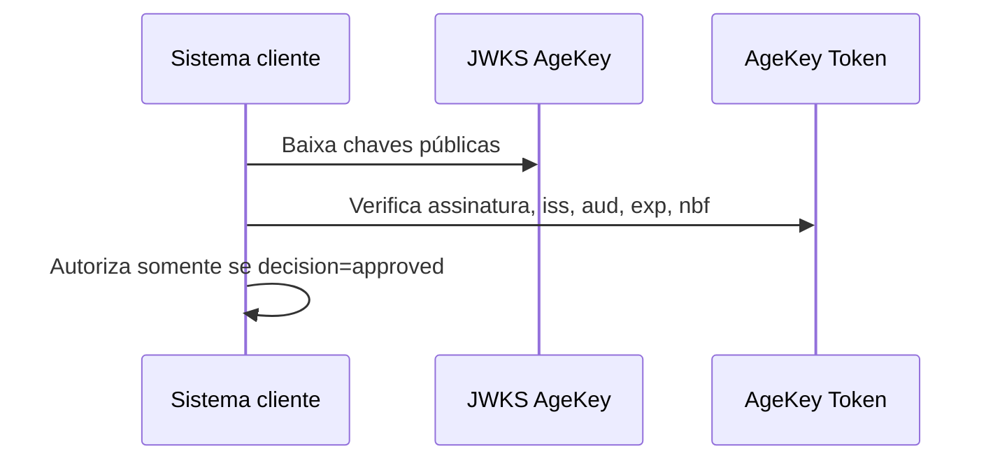
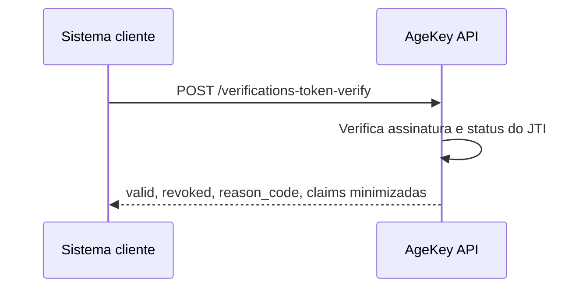

# Especificação - AgeKey Token

## Finalidade

O AgeKey Token é o artefato assinado que permite a uma plataforma cliente verificar que uma sessão satisfez uma política etária, sem receber identidade civil, documento, data de nascimento ou idade exata do usuário final.

O token não é uma identidade digital. Ele é uma chave temporária de elegibilidade etária.

## Formato

Formato recomendado: JWT assinado como JWS.

Algoritmo atual: ES256.

Issuer de produção: `https://agekey.com.br`.

Issuer de staging: `https://staging.agekey.com.br`.

JWKS público:

```txt
https://api.agekey.com.br/.well-known/jwks.json
https://staging.agekey.com.br/.well-known/jwks.json
```

No estado atual do backend, o endpoint JWKS está nas Supabase Edge Functions. Antes de GA, recomenda-se expor proxy em `api.agekey.com.br` para não amarrar o contrato público ao domínio Supabase.

## Claims obrigatórias

```json
{
  "iss": "https://agekey.com.br",
  "aud": "client-or-application-slug",
  "jti": "uuid",
  "iat": 1780000000,
  "nbf": 1780000000,
  "exp": 1780003600,
  "agekey": {
    "decision": "approved",
    "threshold_satisfied": true,
    "age_threshold": 18,
    "method": "vc",
    "assurance_level": "substantial",
    "reason_code": "THRESHOLD_SATISFIED",
    "policy": {
      "id": "uuid",
      "slug": "br-18-plus",
      "version": 1
    },
    "tenant_id": "uuid",
    "application_id": "uuid"
  }
}
```

## Claims opcionais

`sub` pode existir apenas quando for uma referência opaca do cliente. Não deve conter e-mail, CPF, telefone, nome, id civil, username público ou qualquer identificador diretamente rastreável.

Recomendação: se o cliente precisar correlacionar o usuário, enviar `external_user_ref` já como hash HMAC calculado pelo servidor do cliente.

### Claims canônicas opcionais (Rodada Core readiness alignment)

Para alinhar o token ao Decision Envelope canônico, os claims abaixo passam a ser **aceitos opcionalmente** dentro de `agekey.*`:

```json
{
  "agekey": {
    "decision_id": "uuid v7 do registro de decisão",
    "decision_domain": "age_verify | parental_consent | safety_signal | credential | gateway | fallback",
    "reason_codes": ["AGE_POLICY_SATISFIED", "..."]
  }
}
```

Compatibilidade:

- Tokens emitidos **sem** essas extensões continuam válidos e aceitos pelos verificadores.
- Tokens emitidos **com** essas extensões passam pela mesma validação ES256 + JWKS + `iss`/`aud`/`exp`/`nbf`.
- O schema canônico é `ResultTokenClaimsCanonicalSchema` em `@agekey/shared/schemas`. O legado (`ResultTokenClaimsSchema`) tolera as extensões silenciosamente.

## Claims proibidas

O token nunca deve conter:

```txt
birthdate
date_of_birth
dob
idade
age
exact_age
document
cpf
rg
passport
name
full_name
email
phone
selfie
face
raw_id
address
```

Observação: `age_threshold` é permitido porque informa a política satisfeita, não a idade da pessoa.

## TTL

Padrão recomendado:

- sessões: 15 minutos;
- nonce/challenge: 5 minutos;
- token: 1 hora para fluxos web de baixo risco;
- token: até 24 horas apenas em integrações server-to-server justificadas;
- revalidação obrigatória quando a política ou risco do cliente exigir.

## Validação offline

Um cliente pode validar offline quando tiver:

1. JWKS atualizado;
2. issuer esperado;
3. audience esperado;
4. clock skew definido;
5. política de revogação compatível com o risco.

Fluxo:



## Validação online

A validação online consulta o endpoint AgeKey e permite checar revogação explícita de JTI.

Fluxo:



## Revogação

Revogação ocorre por JTI. Motivos típicos:

- comprometimento de chave;
- erro de emissão;
- detecção de replay;
- issuer revogado;
- solicitação do tenant;
- incidente de segurança.

## Exemplo aprovado

```json
{
  "iss": "https://agekey.com.br",
  "aud": "dev-app",
  "jti": "018f7b8c-1111-7777-9999-2b31319d6eaf",
  "iat": 1780000000,
  "nbf": 1780000000,
  "exp": 1780003600,
  "agekey": {
    "decision": "approved",
    "threshold_satisfied": true,
    "age_threshold": 18,
    "method": "gateway",
    "assurance_level": "substantial",
    "reason_code": "THRESHOLD_SATISFIED",
    "policy": {
      "id": "018f7b8c-aaaa-bbbb-cccc-2b31319d6eaf",
      "slug": "br-18-plus",
      "version": 1
    },
    "tenant_id": "018f7b8c-dddd-eeee-ffff-2b31319d6eaf",
    "application_id": "018f7b8c-2222-3333-4444-2b31319d6eaf"
  }
}
```

## Exemplo negado

Em regra, não é necessário emitir token para decisão negada. Se o produto optar por emitir tokens negativos para auditoria de fluxo, o TTL deve ser curto e o payload deve seguir a mesma minimização.

```json
{
  "agekey": {
    "decision": "denied",
    "threshold_satisfied": false,
    "age_threshold": 18,
    "method": "fallback",
    "assurance_level": "low",
    "reason_code": "POLICY_ASSURANCE_UNMET"
  }
}
```

## Regras de implementação

1. Nunca assinar token com chave em frontend.
2. Nunca expor private JWK.
3. Rotacionar chaves.
4. Publicar JWKS apenas com chaves públicas.
5. Registrar JTI em `result_tokens`.
6. Checar `revoked_at` na validação online.
7. Não incluir payload bruto de prova no token.
8. Não incluir dados civis no token.
