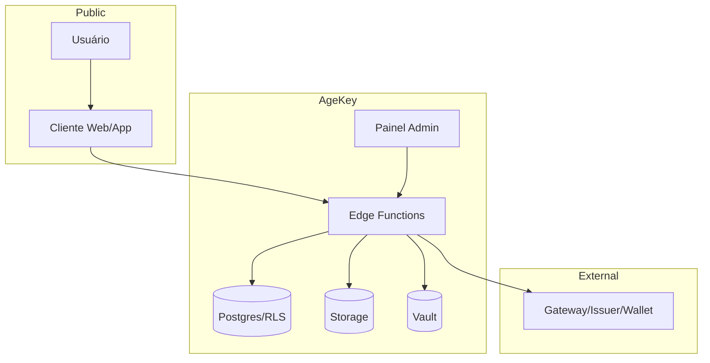

# Threat Model - AgeKey

## Ativos protegidos

- chaves privadas de assinatura;
- API keys de applications;
- webhook secrets;
- result token JTIs;
- proof artifact hashes;
- storage paths;
- tenant boundaries;
- audit logs;
- trust registry;
- policy definitions.

## Atores de ameaça

1. Usuário final tentando burlar restrição etária.
2. Cliente mal configurado enviando PII.
3. Tenant malicioso tentando acessar outro tenant.
4. Atacante externo tentando replay/token forgery.
5. Provider/gateway comprometido.
6. Insider com acesso administrativo.
7. Supply chain dependency compromise.

## Superfícies de ataque

- Edge Functions HTTP;
- painel admin;
- Supabase Auth;
- Postgres RLS;
- Storage;
- webhooks;
- JWKS;
- DNS;
- SDKs;
- CI/CD;
- env vars.

## Ameaças e mitigadores

| Ameaça | Risco | Mitigador |
|---|---|---|
| Reuso de nonce | alto | `verification_challenges.consumed_at` + unique nonce |
| Token forgery | crítico | ES256 + JWKS + kid + issuer/audience |
| Tenant breakout | crítico | RLS + service-only writes + testes cross-tenant |
| Provider spoofing | alto | trust registry + assinatura JWS + issuer esperado |
| PII leakage | alto | privacy guard + logs minimizados + reviews |
| Service role leak | crítico | secrets server-only + Vercel env hygiene |
| Gateway callback spoofing | alto | assinatura provider + nonce binding |
| Storage exposure | alto | bucket privado + signed URL curta |
| Algorithm confusion | alto | rejeitar alg != ES256 |
| Downgrade para fallback | médio/alto | policy assurance enforcement |
| Replay de webhook | médio | timestamp + signature + idempotency |
| DNS takeover | alto | DNS CAA/HSTS + domínio sob controle |

## Boundary diagram

## Decisões de segurança

- O SDK nunca assina token.
- O frontend nunca acessa service_role.
- Artefatos de prova são hash + referência.
- Decisão final é append-only.
- Token é temporário.
- Fallback não satisfaz policy de assurance alta.
